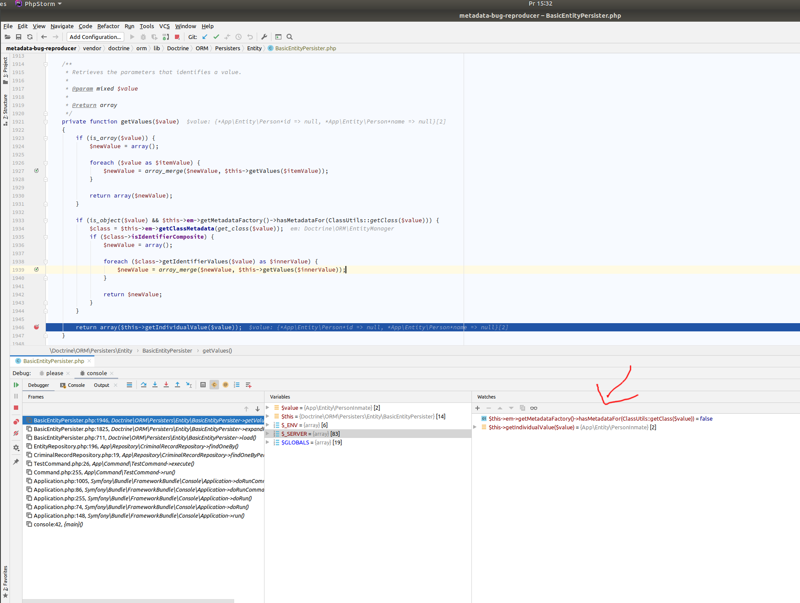

## About the issue

There is a mapped superclass entity `Person` and its derived entity `PersonInmate`.

Calling `\Doctrine\ORM\EntityRepository::findOneBy` with `['person' => new PersonInmate()]` results in an exception.


## Reproducing the issue

```
composer install
bin/console doctr:migrations:migrate
```

```
bin/console app:test
```

It produces the following output

```
# bin/console app:test -vvv
[info] User Deprecated: Auto-registration of the command "Doctrine\Bundle\MigrationsBundle\Command\MigrationsStatusDoctrineCommand" is deprecated since Symfony 3.4 and won't be supported in 4.0. Use PSR-4 based service discovery instead.

[info] User Deprecated: Auto-registration of the command "Doctrine\Bundle\MigrationsBundle\Command\MigrationsGenerateDoctrineCommand" is deprecated since Symfony 3.4 and won't be supported in 4.0. Use PSR-4 based service discovery instead.

[info] User Deprecated: Auto-registration of the command "Doctrine\Bundle\MigrationsBundle\Command\MigrationsExecuteDoctrineCommand" is deprecated since Symfony 3.4 and won't be supported in 4.0. Use PSR-4 based service discovery instead.

[info] User Deprecated: Auto-registration of the command "Doctrine\Bundle\MigrationsBundle\Command\MigrationsMigrateDoctrineCommand" is deprecated since Symfony 3.4 and won't be supported in 4.0. Use PSR-4 based service discovery instead.

[info] User Deprecated: Auto-registration of the command "Doctrine\Bundle\MigrationsBundle\Command\MigrationsDiffDoctrineCommand" is deprecated since Symfony 3.4 and won't be supported in 4.0. Use PSR-4 based service discovery instead.

[info] User Deprecated: Auto-registration of the command "Doctrine\Bundle\MigrationsBundle\Command\MigrationsLatestDoctrineCommand" is deprecated since Symfony 3.4 and won't be supported in 4.0. Use PSR-4 based service discovery instead.

[info] User Deprecated: Auto-registration of the command "Doctrine\Bundle\MigrationsBundle\Command\MigrationsVersionDoctrineCommand" is deprecated since Symfony 3.4 and won't be supported in 4.0. Use PSR-4 based service discovery instead.

[debug] SELECT t0.id AS id_1, t0.person_id AS person_id_2 FROM criminal_record t0 WHERE t0.person_id = ? LIMIT 1

[error] Error thrown while running command "app:test -vvv". Message: "An exception occurred while executing 'SELECT t0.id AS id_1, t0.person_id AS person_id_2 FROM criminal_record t0 WHERE t0.person_id = ? LIMIT 1' with params [{}]:

Notice: Object of class App\Entity\PersonInmate could not be converted to int"

[debug] Command "app:test -vvv" exited with code "1"


In DBALException.php line 179:
                                                                                                                       
  [Doctrine\DBAL\DBALException]                                                                                        
  An exception occurred while executing 'SELECT t0.id AS id_1, t0.person_id AS person_id_2 FROM criminal_record t0 WH  
  ERE t0.person_id = ? LIMIT 1' with params [{}]:                                                                      
                                                                                                                       
  Notice: Object of class App\Entity\PersonInmate could not be converted to int                                        
                                                                                                                       

Exception trace:
  at /home/arnoldas/dev/metadata-bug-reproducer/vendor/doctrine/dbal/lib/Doctrine/DBAL/DBALException.php:179
 Doctrine\DBAL\DBALException::wrapException() at /home/arnoldas/dev/metadata-bug-reproducer/vendor/doctrine/dbal/lib/Doctrine/DBAL/DBALException.php:150
 Doctrine\DBAL\DBALException::driverExceptionDuringQuery() at /home/arnoldas/dev/metadata-bug-reproducer/vendor/doctrine/dbal/lib/Doctrine/DBAL/Connection.php:915
 Doctrine\DBAL\Connection->executeQuery() at /home/arnoldas/dev/metadata-bug-reproducer/vendor/doctrine/orm/lib/Doctrine/ORM/Persisters/Entity/BasicEntityPersister.php:712
 Doctrine\ORM\Persisters\Entity\BasicEntityPersister->load() at /home/arnoldas/dev/metadata-bug-reproducer/vendor/doctrine/orm/lib/Doctrine/ORM/EntityRepository.php:196
 Doctrine\ORM\EntityRepository->findOneBy() at /home/arnoldas/dev/metadata-bug-reproducer/src/Repository/CriminalRecordRepository.php:19
 App\Repository\CriminalRecordRepository->findOneByPerson() at /home/arnoldas/dev/metadata-bug-reproducer/src/Command/TestCommand.php:26
 App\Command\TestCommand->execute() at /home/arnoldas/dev/metadata-bug-reproducer/vendor/symfony/console/Command/Command.php:255
 Symfony\Component\Console\Command\Command->run() at /home/arnoldas/dev/metadata-bug-reproducer/vendor/symfony/console/Application.php:1005
 Symfony\Component\Console\Application->doRunCommand() at /home/arnoldas/dev/metadata-bug-reproducer/vendor/symfony/framework-bundle/Console/Application.php:86
 Symfony\Bundle\FrameworkBundle\Console\Application->doRunCommand() at /home/arnoldas/dev/metadata-bug-reproducer/vendor/symfony/console/Application.php:255
 Symfony\Component\Console\Application->doRun() at /home/arnoldas/dev/metadata-bug-reproducer/vendor/symfony/framework-bundle/Console/Application.php:74
 Symfony\Bundle\FrameworkBundle\Console\Application->doRun() at /home/arnoldas/dev/metadata-bug-reproducer/vendor/symfony/console/Application.php:148
 Symfony\Component\Console\Application->run() at /home/arnoldas/dev/metadata-bug-reproducer/bin/console:42

In PDOStatement.php line 105:
                                                                                 
  [Symfony\Component\Debug\Exception\ContextErrorException]                      
  Notice: Object of class App\Entity\PersonInmate could not be converted to int  
                                                                                 

Exception trace:
  at /home/arnoldas/dev/metadata-bug-reproducer/vendor/doctrine/dbal/lib/Doctrine/DBAL/Driver/PDOStatement.php:105
 Doctrine\DBAL\Driver\PDOStatement->execute() at /home/arnoldas/dev/metadata-bug-reproducer/vendor/doctrine/dbal/lib/Doctrine/DBAL/Connection.php:907
 Doctrine\DBAL\Connection->executeQuery() at /home/arnoldas/dev/metadata-bug-reproducer/vendor/doctrine/orm/lib/Doctrine/ORM/Persisters/Entity/BasicEntityPersister.php:712
 Doctrine\ORM\Persisters\Entity\BasicEntityPersister->load() at /home/arnoldas/dev/metadata-bug-reproducer/vendor/doctrine/orm/lib/Doctrine/ORM/EntityRepository.php:196
 Doctrine\ORM\EntityRepository->findOneBy() at /home/arnoldas/dev/metadata-bug-reproducer/src/Repository/CriminalRecordRepository.php:19
 App\Repository\CriminalRecordRepository->findOneByPerson() at /home/arnoldas/dev/metadata-bug-reproducer/src/Command/TestCommand.php:26
 App\Command\TestCommand->execute() at /home/arnoldas/dev/metadata-bug-reproducer/vendor/symfony/console/Command/Command.php:255
 Symfony\Component\Console\Command\Command->run() at /home/arnoldas/dev/metadata-bug-reproducer/vendor/symfony/console/Application.php:1005
 Symfony\Component\Console\Application->doRunCommand() at /home/arnoldas/dev/metadata-bug-reproducer/vendor/symfony/framework-bundle/Console/Application.php:86
 Symfony\Bundle\FrameworkBundle\Console\Application->doRunCommand() at /home/arnoldas/dev/metadata-bug-reproducer/vendor/symfony/console/Application.php:255
 Symfony\Component\Console\Application->doRun() at /home/arnoldas/dev/metadata-bug-reproducer/vendor/symfony/framework-bundle/Console/Application.php:74
 Symfony\Bundle\FrameworkBundle\Console\Application->doRun() at /home/arnoldas/dev/metadata-bug-reproducer/vendor/symfony/console/Application.php:148
 Symfony\Component\Console\Application->run() at /home/arnoldas/dev/metadata-bug-reproducer/bin/console:42

app:test [-h|--help] [-q|--quiet] [-v|vv|vvv|--verbose] [-V|--version] [--ansi] [--no-ansi] [-n|--no-interaction] [-e|--env ENV] [--no-debug] [--] <command>


```

## The reason

In `\Doctrine\ORM\Persisters\Entity\BasicEntityPersister::getValues` there is no metadata for entity `PersonInmate`, 
i.e., the call to `\Doctrine\Common\Persistence\Mapping\ClassMetadataFactory::hasMetadataFor` returns false. Then the
result from `\Doctrine\ORM\Persisters\Entity\BasicEntityPersister::getIndividualValue` is the object itself which later 
cast to an int.

See 

## Library versions installed

Output from `composer show `
```
doctrine/annotations                1.10.3  Docblock Annotations Parser
doctrine/cache                      1.10.1  PHP Doctrine Cache library is a popular cache implementation that supports many differen...
doctrine/collections                1.6.5   PHP Doctrine Collections library that adds additional functionality on top of PHP arrays.
doctrine/common                     v2.8.1  Common Library for Doctrine projects
doctrine/dbal                       v2.6.3  Database Abstraction Layer
doctrine/doctrine-bundle            1.10.3  Symfony DoctrineBundle
doctrine/doctrine-cache-bundle      1.4.0   Symfony Bundle for Doctrine Cache
doctrine/doctrine-migrations-bundle 1.1.1   Symfony DoctrineMigrationsBundle
doctrine/inflector                  1.4.3   PHP Doctrine Inflector is a small library that can perform string manipulations with reg...
doctrine/instantiator               1.3.1   A small, lightweight utility to instantiate objects in PHP without invoking their constr...
doctrine/lexer                      1.2.1   PHP Doctrine Lexer parser library that can be used in Top-Down, Recursive Descent Parsers.
doctrine/migrations                 v1.8.1  Database Schema migrations using Doctrine DBAL
doctrine/orm                        v2.5.14 Object-Relational-Mapper for PHP
jdorn/sql-formatter                 v1.2.17 a PHP SQL highlighting library
ocramius/package-versions           1.4.2   Composer plugin that provides efficient querying for installed package versions (no runt...
ocramius/proxy-manager              2.2.3   A library providing utilities to generate, instantiate and generally operate with Object...
psr/cache                           1.0.1   Common interface for caching libraries
psr/container                       1.0.0   Common Container Interface (PHP FIG PSR-11)
psr/log                             1.1.3   Common interface for logging libraries
psr/simple-cache                    1.0.1   Common interfaces for simple caching
symfony/cache                       v3.4.41 Symfony Cache component with PSR-6, PSR-16, and tags
symfony/class-loader                v3.4.41 Symfony ClassLoader Component
symfony/config                      v3.4.41 Symfony Config Component
symfony/console                     v3.4.41 Symfony Console Component
symfony/debug                       v3.4.41 Symfony Debug Component
symfony/dependency-injection        v3.4.41 Symfony DependencyInjection Component
symfony/doctrine-bridge             v3.4.41 Symfony Doctrine Bridge
symfony/dotenv                      v3.4.41 Registers environment variables from a .env file
symfony/event-dispatcher            v3.4.41 Symfony EventDispatcher Component
symfony/filesystem                  v3.4.41 Symfony Filesystem Component
symfony/finder                      v3.4.41 Symfony Finder Component
symfony/flex                        v1.7.1  Composer plugin for Symfony
symfony/framework-bundle            v3.4.41 Symfony FrameworkBundle
symfony/http-foundation             v3.4.41 Symfony HttpFoundation Component
symfony/http-kernel                 v3.4.41 Symfony HttpKernel Component
symfony/polyfill-apcu               v1.17.0 Symfony polyfill backporting apcu_* functions to lower PHP versions
symfony/polyfill-mbstring           v1.17.0 Symfony polyfill for the Mbstring extension
symfony/routing                     v3.4.41 Symfony Routing Component
symfony/var-dumper                  v3.4.41 Symfony mechanism for exploring and dumping PHP variables
symfony/yaml                        v3.4.41 Symfony Yaml Component
zendframework/zend-code             3.4.1   Extensions to the PHP Reflection API, static code scanning, and code generation
zendframework/zend-eventmanager     3.2.1   Trigger and listen to events within a PHP application
```